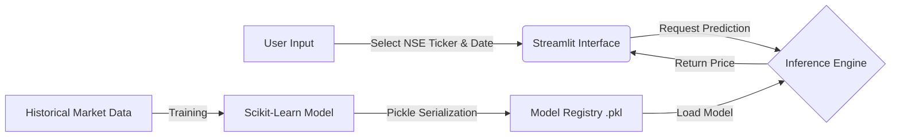

# 📈 Nigerian Stock Market Predictor

An end-to-end Machine Learning pipeline that predicts stock prices for **10 major blue-chip companies** listed on the **Nigerian Stock Exchange (NSE)**. This project handles multi-sector financial data (Banking, FMCG, Telco, etc.) and serves the model via an interactive web interface.

> **🔴 Live Demo:** <https://nigerian-stock-market-price-prediction-web.streamlit.app/>

## 🏗️ Engineering Architecture

This project implements a full inference pipeline, decoupling the training logic from the user-facing application.


## 🛠️ Tech Stack & Tools

**Machine Learning & Data:** Scikit-learn, Pandas, NumPy

**Deployment & App:** Streamlit, Python

## 🚀 Key Features (Engineering Focus)

* **End-to-End Pipeline:** Successfully integrated data preprocessing, model inference, and frontend visualization into a single deployable unit.
* **Multi-Sector Capability:** The model is trained to handle volatility across different industries on the NSE, not just banking sectors.
* **Model Persistence:** Utilized `joblib/pickle` for efficient model serialization, allowing for low-latency inference without retraining on every request.
* **Scalable Architecture:** Designed the codebase with modular functions, making it easy to add new tickers (e.g., MTN, Dangote Cement) without breaking the UI logic.

## 💻 Local Installation

To run this inference pipeline on your local machine:

1. **Clone the repository**
```bash
git clone https://github.com/Datechgeek/Nigerian-Stock-Market-Price-Prediction.git
cd Nigerian-Stock-Market-Price-Prediction
```

2. **Install dependencies**
```bash
pip install -r requirements.txt
```

3. **Run the application**
```bash
streamlit run app.py
```

## 📊 Model Performance

* **Best Performing Algorithm:** Linear Regression
* **Metrics:** Achieved an MAE of 0.0135 during validation testing.
* *Note: Financial market prediction is stochastic; this tool serves as a technical demonstration of my ML engineering capabilities rather than financial advice.*

---

**Author:** Micah Okpara

*Connect with me:* [LinkedIn](https://www.linkedin.com/in/micah-okpara/) | [Twitter](https://x.com/Micah_AI)
